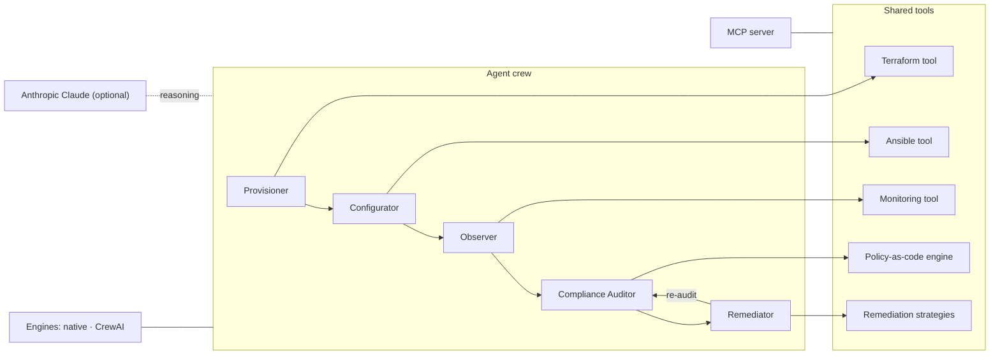

# InfraPilot 🛰️

**Agentic AI for infrastructure operations.** A multi-agent system that
**provisions**, **monitors**, **validates compliance** and **auto-remediates**
cloud, network and security infrastructure — built on **Python**, **MCP**,
**CrewAI**, **Terraform** and **Ansible**.

[](https://github.com/Gsfrota/infra-pilot/actions/workflows/ci.yml)


> InfraPilot closes the full ops loop end-to-end:
> **provision → configure → observe → audit → remediate → re-audit**,
> coordinated by a crew of specialised AI agents — and it runs out of the box
> with **no cloud account, no API key and no Terraform/Ansible binaries
> required** (it transparently simulates execution when a binary is absent).

---

## Why it exists

Most "AI for DevOps" demos stop at a chatbot that writes a Terraform snippet.
InfraPilot models the *operational loop* an automation engineer actually owns:
turning declarative intent into running infrastructure, watching it, proving it
meets security/governance policy, and **fixing drift automatically through
code** — with every action typed, reported and auditable.

## Architecture



- **Two interchangeable engines.** `native` (zero heavy deps, drives the loop
  deterministically, used in CI) and `crewai` (maps the same crew onto a CrewAI
  `Crew` with an LLM). Swap with `--engine`.
- **Tools are the source of truth.** Terraform, Ansible, monitoring, policy and
  remediation logic live in `infrapilot/tools/` and are shared by every engine
  *and* the MCP server — so there is one implementation, three ways to drive it.
- **MCP-native.** `infrapilot/mcp_server/` exposes the tools over the **Model
  Context Protocol**, so Claude Desktop / Claude Code / any MCP client can run
  infra operations through natural language.
- **LLM optional.** With `ANTHROPIC_API_KEY` set, agents use Claude to triage
  anomalies and justify remediations. Without it, everything still runs.

## Quickstart

```bash
git clone https://github.com/Gsfrota/infra-pilot && cd infra-pilot
python -m venv .venv && source .venv/bin/activate
pip install -e ".[dev]"

infrapilot demo          # fully simulated end-to-end run — no creds needed
```

Example output (abridged):

```
╭──────────────────────── InfraPilot run ────────────────────────╮
│ engine=native  llm=off  compliance score=100.0/100             │
╰────────────────────────────────────────────────────────────────╯
 provision   ok     4 resources provisioned (simulated)
 configure   ok     configuration applied (simulated)
 observe     warn   3 anomalies detected
 audit       error  3 violations, score 43.8
 remediate   ok     3 fixes applied, score 43.8 -> 100.0
```

### Commands

| Command | What it does |
| --- | --- |
| `infrapilot demo` | Self-contained simulated run (no cloud/API key/binaries). |
| `infrapilot run` | Full loop; uses real `terraform`/`ansible` if installed. |
| `infrapilot run --no-remediate` | Audit + propose fixes without applying. |
| `infrapilot run --engine crewai` | Drive the crew with CrewAI + Claude. |
| `infrapilot audit` | Compliance gate — exits non-zero on any violation (great in CI). |

### Use it from Claude (MCP)

```bash
pip install -e ".[mcp]"
infrapilot-mcp            # serves the tools over MCP (stdio)
```

```jsonc
// claude_desktop_config.json
{
  "mcpServers": {
    "infrapilot": { "command": "infrapilot-mcp" }
  }
}
```

Then ask Claude: *"Provision the infra, audit it for security issues, and
remediate anything critical."*

## How the loop works

1. **Provision** — `TerraformTool` applies `infra/desired_state.yaml` (real
   `terraform apply` against the local/null/random providers when the binary is
   present; simulated otherwise).
2. **Configure** — `AnsibleTool` converges host configuration via a playbook.
3. **Observe** — `MonitoringTool` ingests a Prometheus-style telemetry snapshot
   and triages anomalies against thresholds.
4. **Audit** — the **policy-as-code** engine evaluates every resource against
   `policies/policies.yaml`; new governance rules are added in YAML, not code.
5. **Remediate** — `RemediationTool` maps each violation to a least-privilege
   fix and applies it through the right IaC backend (Terraform or Ansible).
6. **Re-audit** — the loop re-scores compliance to prove the drift is closed.

## Policy-as-code

```yaml
- id: SEC-001
  name: "No SSH open to the internet"
  severity: critical
  resource_type: security_group
  rule: no_ingress_cidr
  params: { port: 22, forbidden_cidr: "0.0.0.0/0" }
  remediation: restrict_sg_ingress
```

Built-in rules: `required_tag`, `no_ingress_cidr`, `attribute_equals`,
`attribute_max`. Built-in remediations: `add_tag`, `restrict_sg_ingress`,
`enable_encryption`, `restart_service`.

## Project layout

```
infrapilot/
├── agents/        # role/goal/backstory crew (engine-agnostic)
├── engines/       # native + crewai orchestrators
├── tools/         # terraform · ansible · monitoring · compliance · remediation
├── mcp_server/    # MCP server exposing the tools
├── llm.py         # optional Anthropic reasoning layer
├── reporting.py   # rich console + JSON/Markdown artifacts
└── cli.py         # typer CLI
infra/             # terraform/, ansible/, observability/, desired_state.yaml
policies/          # policy-as-code
tests/             # pytest suite (engine, compliance, monitoring, remediation)
```

## Development

```bash
pip install -e ".[dev]"
ruff check .          # lint
pytest                # tests
infrapilot demo       # smoke test the full loop
```

CI (GitHub Actions) runs ruff + pytest on 3.10/3.11/3.12 and additionally
installs **real Terraform and Ansible** to `validate`/`lint` the IaC.

## Roadmap

- [ ] Real cloud providers behind a feature flag (AWS/GCP modules)
- [ ] LangChain tool adapter alongside CrewAI
- [ ] Drift detection on a schedule (cron / GitHub Actions)
- [ ] OPA/Rego policy backend option

## License

MIT — see [LICENSE](LICENSE).

---

Built by [Guilherme Frota Souza](https://github.com/Gsfrota) — automation & AI engineer.
